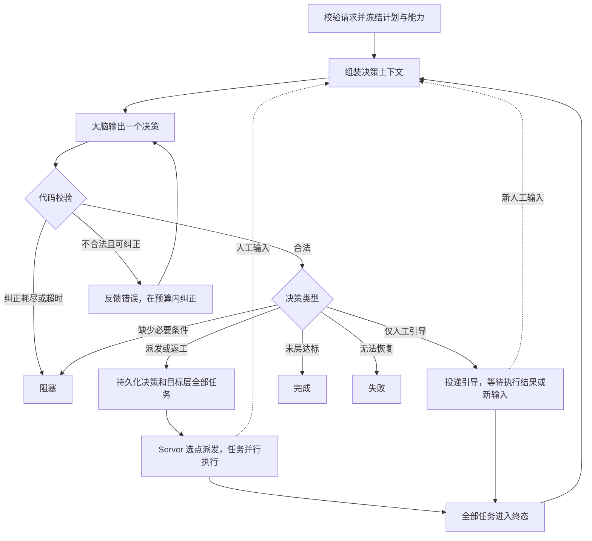

Commit: c854143bd187656f4d74be6cca0f153176e44a21

# 规则 06：大脑调度约定

修改 Brain 计划、能力绑定、决策、派发、结果评估、人工引导或恢复逻辑之前，先读本规则。核心策略是：**按里程碑分层，同层并行，整层结束后检查结果，再决定前进、返工或停止。**

本规则约束调度行为；接口与请求示例见 [运行协议](../docs/brain-orchestration.md)。涉及 DAG 的执行、资源和工作区时，同时遵守 [规则 04](04-dag-execution-contract.md)。不能只修改提示词来绕过代码约束。

## 职责与计划

- 大脑负责绑定任务输入、依据执行证据评估里程碑、选择下一层和说明理由。调度规则与状态变更使用纯函数，模型调用、存储和派发由外围适配。
- Server 负责准入、冻结定义、选择执行节点、创建子执行、组装决策上下文和转交回执；所属 Worker 是大脑运行状态的唯一写入方，保存操作索引、事件和恢复记录。
- 能力执行者负责本节点任务与结果，接收本节点说明和绑定输入。全局计划、反思与层间调度由大脑处理；不能要求子执行等待同层任务或接管根目标调度。
- 新计划和运行使用 `schema_version: 7`。`layers` 是有序里程碑，每层必填名称、任务、目标和达成标准；`nodes` 通过 `layer_id` 归属一层，每个节点只绑定一个能力。
- 计划限制为 1–32 层、每层 1–32 个节点、总计 1–256 个节点。画布坐标不决定执行顺序。
- 保存计划产生不可变版本，保存与启动运行分开。运行准入冻结计划、所引用能力的定义和输入输出约定；运行中不能检索能力库来增加节点或替换能力。
- Agent、Operator、Team、DAG、TODO 和嵌套 Brain 复用已有执行接口，遵守相同调度校验。嵌套计划必须引用固定的已保存版本、绑定真实父 operation；根深度为 0，最多深度 3。
- 历史 schema 4/5/6 计划与已结束运行只读；编辑旧计划须显式创建 schema 7 新版本。`v4/` 是现有实现目录名，不代表新运行使用 schema 4。

## 调度流程

- 创建运行、整层结束和人工输入唤醒决策；恢复命令根据当前执行状态和待处理输入决定重新决策或继续等待。正在等待子执行时，不反复调用模型查询进度。
- 每次生产模型激活通过 OpenCoder agent loop 消费有限上下文，输出一个结构化决策后结束。调度会话不开放执行工具；模型提议须通过代码校验才能派发。
- 上下文包含完整计划、冻结能力说明、根输入、各层最近一次激活的结果、当前轮次、错误和人工输入。完整历史保留在日志；已失效的历史结果只作为分析证据，不自动恢复其通过结论。
- 决策类型为 `dispatch_layer`、`complete`、`block`、`fail` 和 `guide`。业务达标结论由模型依据证据判断；代码强制检查任务状态、评估字段、层顺序、输入引用和预算。

## 整层派发、评估与完成

- 首次派发必须从第一层开始。每次派发覆盖目标层全部节点，每个节点调用所绑定能力一次；不能漏发、重复调用或替换能力。
- 同层任务允许并行，实际启动受执行节点容量和排队影响。必须等本次派发的全部任务进入 `Done`、`Error` 或 `Cancelled` 后，才可评估或调度下一层；这就是层屏障。
- 某个任务失败时，大脑调度层不自动重试该任务，也不自动取消同层其他任务。继续收集整层结果，再统一决定返工、阻塞或失败。
- `Done` 只表示能力执行成功结束。大脑必须检查完整结构化结果和业务结论；例如测试正常结束但返回 `passed: false`，不能据执行状态直接判定达标。`summary` 不能覆盖相反的结果字段，人工输入也不能代替执行证据。
- 首次派发的 `assessments` 为空；后续派发与完成只评估当前 `layer_id`，且必须给出达标结论和理由。前进或完成要求当前层全部任务成功，并且 `met: true`。
- 正常前进只能到紧邻下一层，不能跳层。只有到达最后一层、当前有效的各层均已通过，才能 `complete` 并保存最终结果。

## 返工与轮次预算

- 需要返工时，可重做本层或返回任一已执行层；必须给出非空 `reflection`，说明问题、证据和返工理由，并把修改要求转成具体任务输入。
- 每次返工开启新一轮，目标层及后续层以前的通过结论失效；重新派发目标层的全部节点，并按正常顺序重新验证后续层。历史执行、结果、输入和派发理由保留。
- 首轮是第 1 轮，正常前进不增加轮数。默认预算 5 轮，允许 1–32 轮；达到预算后仍可正常前进或完成，但若还需返工，必须进入 `blocked`，不创建新执行。
- 仅在暂停或阻塞时允许 `set_round_budget`，新预算必须大于当前轮次且不超过 32；调整后通过 `resume` 恢复。
- 每次派发增加 `activation`，生成独立 operation/execution ID。不能复用上轮 ID 执行返工。

例：第 1 轮开发通过、测试发现问题；第 2 轮返回开发层修复，再执行测试层。旧测试结果不能证明新代码已通过。

## 输入、输出与工作区

- 输入绑定支持根输入、已登记产物、终态执行输出的 JSON pointer 和具体值。引用必须存在且可解析，实际值还须通过能力必填字段校验；失败结果也可以作为整改输入。
- 必填字段缺失、为 `null` 或空白文本时校验失败；`false`、`0` 和空数组是有效数据。字段校验不能替代业务达成标准。
- 叶子能力交给大脑的成功结果最多 16 KiB，保留完整结构化字段；大文件和长报告用产物引用。输出缺失或超限转为 `Error`，完整结果留在子执行，传给大脑的失败证据须标明省略部分。
- 各子执行有各自的工作区。开发、测试等任务之间必须显式传递代码版本、补丁或产物，并依据同一版本的验证结果判断完成；不能假设其他执行的本地文件已存在。
- 一个 DAG 内部的步骤仍按规则 04 共享该次运行的工作区，不因 Brain 调度而改变其单节点、单容器约定。

## 执行节点选择

- 根 Brain 和托管子执行的节点必须支持 `brain_scheduler_v7`、`brain_contracts_v1`；DAG 另须满足其容器与动态能力要求。
- 先筛选准入允许、在线、心跳有效、已就绪且支持执行类型的节点；能力探测不通过时排除该节点。显式指定节点时，不能改派其他节点。
- 有空闲名额时，优先选择 `(active_agent_loops + reserved_loops) / cpu_capacity` 最小的节点；相同负载优先 CPU 容量较大的节点，再按节点 ID 排序。预留数量参与选点，防止并发受理重复占用名额。
- 无空闲名额时，可以选择 `pending_runs + reserved_loops` 最小的就绪节点持久化排队，同值按节点 ID 排序；没有兼容就绪节点则返回不可用。已受理不代表已开始执行。
- 普通子执行由统一调度器分别选点，可位于不同节点。嵌套 Brain 必须跟随父 Brain 所属节点；一次 DAG 的全部步骤始终由同一个执行节点负责。
- 派发一经固定，重试和恢复复用原执行 ID、定义与节点归属，不能因回执超时另选机器重复创建执行。

## 人工引导与运行控制

- 人工文本先写入运行事件，再交给大脑决策。正在决策时收到新输入，旧决策失效，重新组装上下文；暂停期间只记录输入，恢复后处理。
- 本层尚未全部终态时，模型只能输出 `guide`，不能派发、评估、完成、阻塞或宣告失败。引导可调整后续任务输入，但不能越过层屏障。
- 即时引导只面向当前激活中正在运行的 Agent、Operator 或 Team。Agent/Operator 接收 steer；Team 在下一次成员发问时应用，正在生成的成员回答不被打断。
- 已结束任务和运行中的 DAG 不接收即时引导。DAG 需要改图时，先停止原运行，再提交新运行。
- `pause` 停止继续调度，不自动停止已启动的子任务；尚未派发的意图保留供恢复。`resume` 只用于暂停或阻塞的运行，并保留上次错误供模型纠正。
- `cancel` 将根运行标为取消，向未结束的子执行发出取消请求，并继续处理其取消回执。
- 人工输入可重新唤醒阻塞运行，但不能绕过预算或其他校验；暂停运行仍须显式恢复。

## 失败、持久化与恢复

- 区分任务返工与派发重试：派发遇到 5xx、408、423、429 时重试同一意图；输入引用或字段错误等明确拒绝形成 `Error` 终态及诊断，不能无限重复错误请求或等待不存在的子执行。
- 非法模型决策最多纠正两次，连同首次共三次尝试，共用五分钟预算。尝试次数、截止时间和校验错误持久化，重启不重置预算；仍不合法或超时则阻塞，不派发未通过校验的任务。
- 决策和创建意图必须先落盘，再发布操作索引和派发消息。未确认的唤醒、派发、引导、取消与终态回执可重放；接收方按身份、代次和序号去重。
- `generation` 校验阻止旧上下文或旧决策覆盖新状态；`activation`、执行身份和来源序号阻止迟到或重复回执推进当前层。
- Server 重启后继续向所属节点读取状态并转交事件；Worker 根据已持久化的上下文、决策和意图恢复。不得重新规划已经提交的派发或覆盖历史理由。

## 实现依据与变更验收

代码入口：[决策校验](../crates/brain/src/layered/decide.rs)、[终态与控制](../crates/brain/src/layered/terminal.rs)、[输入与输出约定](../crates/brain/src/contracts.rs)、[派发适配](../crates/control/src/api/brain_runs/v4/gateway.rs)、[节点选择](../crates/core/src/fleet/scheduling.rs)、[决策持久化](../crates/worker/src/brain/v4/run.rs)、[纠错预算](../crates/worker/src/brain/v4/correction.rs)。

修改相关实现时，测试必须覆盖受影响的规则；现有行为用例入口：

| 范围 | 测试文件 |
|------|----------|
| 同层屏障、失败等待、返工、轮次与完成 | [milestone.rs](../crates/brain/tests/milestone.rs) |
| 节点唤醒、决策纠错、引导与预算恢复 | [brain_scheduler_v4.rs](../crates/worker/tests/brain_scheduler_v4.rs) |
| 实际人工引导链路 | [brain_guidance_e2e.rs](../crates/worker/tests/brain_guidance_e2e.rs) |
| 输入输出校验、明确拒绝及重复回执 | [brain_contracts.rs](../crates/worker/tests/brain_contracts.rs)、[brain_dispatch_failures.rs](../crates/worker/tests/brain_dispatch_failures.rs) |
| 开发、测试、整改与版本传递 | [brain_closed_loop.rs](../crates/worker/tests/brain_closed_loop.rs) |
| 嵌套计划及父子终态 | [brain_nested.rs](../crates/worker/tests/brain_nested.rs) |
| Server 重启与离线决策恢复 | [brain_server_restart.rs](../crates/worker/tests/brain_server_restart.rs) |

调度策略变更须明确记录用户决定，并同步修改本规则、实现、测试、运行协议和相关仓库记忆。实现验收遵守 [规则 01](01-mandatory-tests.md)、[规则 02](02-regression-gate.md)；涉及 DAG 或界面时同时遵守 [规则 04](04-dag-execution-contract.md)、[规则 05](05-ui-acceptance.md)。
