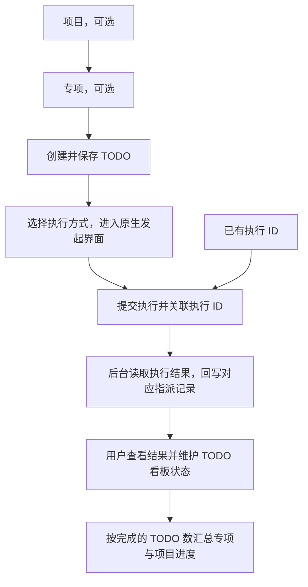

Commit: c854143bd187656f4d74be6cca0f153176e44a21

# 规则 07：项目模块约定

修改项目、专项、TODO 的数据关系、看板、标签、执行关联、结论回写或进度计算之前，先读本规则。核心职责是：**项目承载整体目标，专项组织某一方向的工作，TODO 记录具体要完成的事情，执行记录保存实际执行过程和结果。**

业务入口见 [项目工作台](../features/project/index.md)，实现索引见 [project 模块](../agents/project/index.md)。涉及大脑调度时同时遵守 [规则 06](06-brain-scheduling-contract.md)，涉及 DAG 执行时同时遵守 [规则 04](04-dag-execution-contract.md)。

## 对象、归属与职责

| 对象 | 职责 | 当前主要信息与状态 |
|------|------|--------------------|
| 项目 | 承载整体目标、说明与总体进度 | 名称、说明、排序；`active` 进行中、`archived` 已归档 |
| 专项 | 组织某一方向的一组工作 | 名称、说明、可选所属项目、排序；`planned` 未开始、`in_progress` 进行中、`done` 已完成 |
| TODO | 跟踪具体任务及交付结果 | 标题、任务说明、可选所属专项、看板列、位置、标签、执行方式和指派历史 |
| 执行记录 | 记录为 TODO 发起或关联的一次执行 | 执行类型、名称、ID、执行状态，以及该条关联的同步状态和独立结论 |

- 层级是 TODO → 可选专项 → 可选项目。一个项目可含多个专项，一个专项可含多个 TODO；每个专项最多归属一个项目，每个 TODO 最多归属一个专项。
- 专项可以独立存在，TODO 可以未归属专项；TODO 通过专项确定所属项目，不直接挂载项目。新建或调整归属时须验证目标存在。
- 项目在代码和 API 中使用 `goal`，专项使用 `initiative`；不能因为内部名称不同再增加一套并列对象。
- 项目、专项和 TODO 负责组织与跟踪工作。任务拆分、保存和指派由用户显式发起，保存任务说明不自动解析能力、创建执行或展开大脑计划。
- 一个 TODO 可以关联多次执行，每次保留独立结果。不能将 TODO 等同于某个 Agent 会话、某次 DAG 运行或某次 Brain 激活。
- 项目里程碑入口已移除，存量里程碑下的 TODO 已转为未归属任务；不能重新加入旧里程碑层级。大脑计划内的里程碑层属于执行编排，与专项没有自动的一一映射。

## 从任务到执行的流程

1. 创建或编辑 TODO，保存标题、任务说明、归属、标签和看板状态。
2. 选择 Agent、Operator、Team、DAG 工作流、TODO 工作流或 Brain，进入对应原生界面。TODO 标题和说明预填为可修改的任务输入；具体执行对象、计划及参数在原生界面确定。
3. 用户提交后，将返回的执行 ID 关联到 TODO；也可直接粘贴已有执行 ID。关联接口只接受实际存在且属于上述六种类型的执行。
4. 同一 TODO 重复关联同一执行须幂等，不产生重复记录，也不覆盖已有结论。执行已创建但关联失败时保留 ID，允许重试关联，不能为补关联再次创建执行。
5. 后台读取执行节点上的结果，写入对应指派记录；用户可按执行 ID 打开原生明细，并据结果决定后续工作和看板状态。

指派历史必须保留各次执行的类型、名称、ID、状态和结论；新的指派不能覆盖旧指派。TODO 抽屉展示指派历史及最新指派已有的结论，旧结论仍可从各自记录查看。

## 看板状态、执行状态与回写状态

三种状态分别维护，不能相互替代：

| 状态 | 含义 | 更新来源 |
|------|------|----------|
| TODO 看板状态 `board_status` | 这件任务目前推进到哪一步 | 用户编辑或拖动 |
| 执行状态 | 某一次执行正在等待、运行、结束、失败或取消 | 对应执行系统 |
| 关联的 `sync_state` | 该次执行的结论是否已收集 | 后台同步 |

- 看板列固定为 `backlog` 待整理、`todo` 待办、`in_progress` 进行中、`done` 已完成。允许调整列和列内顺序，不由执行回执自动移动卡片。
- 执行成功、执行结束或结论回写都不能自动将 TODO 标为已完成；“结论已回写”只代表取得了非空结果，不代表任务通过验收。
- 同步状态区分 `pending` 待结论、`complete` 已回写、`empty` 已结束但无结论、`error` 执行失败和 `cancelled` 已取消。不能以空字符串、占位提示或读取失败冒充结论。
- 回写只更新对应的执行关联记录，不覆盖 TODO 的任务说明、旧计划字段或看板列。节点查询失败保留待同步状态，后续继续尝试；概览中的已保存任务不因节点不可读而消失或改状态。
- 原生执行明细由执行 ID 和所属节点定位；不能由项目页面另造一份执行状态机。运行中的 Team 可通过原生详情提交引导。
- 数据中旧 `ProjectTodoStatus` 的 `draft/planned/running/done/failed` 属于旧项目执行路径；当前看板、进度和用户状态编辑以 `board_status` 为准。

## 结论来源

- Agent、Operator 使用节点保存的助手输出正文；Team 使用最终总结；TODO 工作流汇总各任务候选结果；DAG 读取步骤输出；Brain 使用调度运行结果。
- Agent、Operator 在已有可读输出的 `Idle` 状态也可回写；其他类型按执行完成状态收集。不能把仍未完成的中间输出写成最终结论。
- 执行结束与产物可读之间允许等待；最终没有结论、执行失败和取消须分别展示，读取错误须可见且可重试。
- 结论存于各条 TODO 与执行的关联记录；完整过程和产物仍由原生执行系统提供。解除关联只移除该条关联，不发送取消执行命令。

## 进度计算

- 专项进度＝该专项中 `board_status = done` 的 TODO 数 ÷ 该专项 TODO 总数。
- 项目进度＝所属全部专项中 `board_status = done` 的 TODO 数 ÷ 所属全部专项 TODO 总数；不能简单平均专项百分比。
- 无 TODO 时显示 0%；未归属专项的 TODO 不计入任何专项或项目，独立专项的 TODO 不计入项目。
- 多标签分组造成的重复展示只计同一 TODO 一次；筛选后的可见卡片数量不能替代整体进度的分母。
- 专项自身状态、项目是否归档和完成比例分别维护；进度达到 100% 不自动修改专项状态或归档项目。

例：专项 A 有 1 个 TODO 且已完成，专项 B 有 9 个 TODO 且均未完成，所属项目进度为 10%。

## 标签与页面操作

- 项目与专项均可创建、改名和删除 Tag；同一范围内名称唯一。专项继承所属项目的 Tag，同名时使用专项定义。
- 一个 TODO 可选多个当前归属范围内的 Tag；未归属专项的 TODO 没有可选 Tag，不能接受其他范围的标签关联。
- 改变归属、覆盖或删除标签定义后，按名称匹配新的可用标签；有同名定义则接替，没有则清除失效关联。无效标签选择不能留下部分成功的任务或关联修改。
- 按 Tag 分组时，一个 TODO 可展示在多个组内；状态变化须同步到各处展示，保存的仍是同一条 TODO。
- 工作台保留项目、专项、TODO 三个表格页签；项目详情展示专项与进度，专项详情展示 TODO 看板，TODO 详情展示任务与指派记录。
- 筛选条件在刷新、保存和关闭后重新打开详情时保留。筛选后拖动须保留隐藏卡片的相对顺序；保存失败恢复原看板状态。
- TODO 总表包含所有归属和未归属任务；已有悬空关系在概览中展示为独立专项或未归属 TODO，不能静默丢失。

## 删除与解除归属

- 删除项目时，保留其专项、TODO 和执行记录；专项解除项目归属，项目 Tag 按剩余可用定义重新匹配。
- 含 TODO 的专项不能删除，须先移动 TODO 或解除归属；不能通过删除专项连带删除任务。
- 删除 TODO 时，清理该任务的标签关联、执行关联和旧 Project 运行记录。已关联的原生执行仍由执行系统管理，删除任务或解除关联不作为取消执行命令。

## 执行边界与实现依据

- 项目 TODO 是任务管理记录；TODO 工作流是可选的执行能力，内部有独立任务与运行状态，不能混用两者的 ID、状态或完成规则。
- TODO 交给 Brain 时选择已保存的计划版本并传入任务输入，关联整次 Brain 运行；Brain 的里程碑、节点和返工轮次留在该次运行内。其完成结果回写不改变项目 TODO 的看板状态。
- 执行关联与原生详情由 Server 控制台提供。独立 Web 的旧项目 API 不提供控制台执行索引，不能据此假定执行不存在。
- 旧 `ProjectService` 的 plan/execute 路径与历史记录仍有独立实现，当前项目页面不提供旧的专属计划、执行或回放入口；维护时不能把旧路径的状态规则套到看板指派链路。
- 项目业务数据通过 `ProjectStore` 持久化；关系投影、进度、标签选择与重匹配使用纯函数，API、UI 和执行回写复用相同规则。

代码入口：[数据定义](../crates/store/src/project_types.rs)、[存储接缝](../crates/store/src/project.rs)、[概览与进度](../crates/store/src/project/overview.rs)、[标签规则](../crates/store/src/project/tags.rs)、[原生执行入口](../crates/web/spa/src/project/execute/launcher.jsx)、[执行关联](../crates/control/src/api/project_links.rs)、[结论同步](../crates/control/src/scheduler/project_assignments.rs)。

## 变更验收

修改相关实现时，测试必须覆盖受影响的行为；现有用例入口：

| 范围 | 测试文件 |
|------|----------|
| 可选归属、删除保护、执行关联与历史数据 | [project_relations.rs](../crates/store/tests/project_relations.rs)、[project_store/suite_2.rs](../crates/store/tests/project_store/suite_2.rs) |
| 标签继承、覆盖、重匹配与失败回滚 | [project_tags.rs](../crates/store/tests/project_tags.rs) |
| 六类执行关联、幂等与结论记录 | [project_links.rs](../crates/control/tests/e2e/project_links.rs) |
| 原生结果字段与空结论处理 | [project_assignments.rs](../crates/control/src/scheduler/project_assignments.rs) 内联测试 |
| 看板完成数与项目加权进度 | [overview.rs](../crates/store/src/project/overview.rs) 内联测试、[catalog.test.js](../crates/web/spa/src/project/model/catalog.test.js) |
| 归属编辑、看板移动与筛选保留 | [relations.dom.test.jsx](../crates/web/spa/src/project/views/relations.dom.test.jsx)、[board.test.js](../crates/web/spa/src/project/model/board.test.js)、[project.dom.test.jsx](../crates/web/spa/src/project/project.dom.test.jsx) |
| 执行发起、关联及详情切换 | [launcher.dom.test.jsx](../crates/web/spa/src/project/execute/launcher.dom.test.jsx)、[todoDrawer.dom.test.jsx](../crates/web/spa/src/project/tests/todoDrawer.dom.test.jsx) |

改变上述业务规则须明确记录用户决定，并同步修改本规则、实现、测试和相关仓库记忆。实现验收遵守 [规则 01](01-mandatory-tests.md)、[规则 02](02-regression-gate.md)；界面变更同时遵守 [规则 05](05-ui-acceptance.md)。
